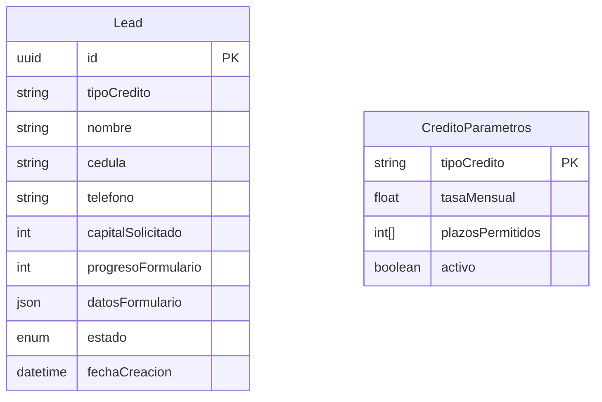
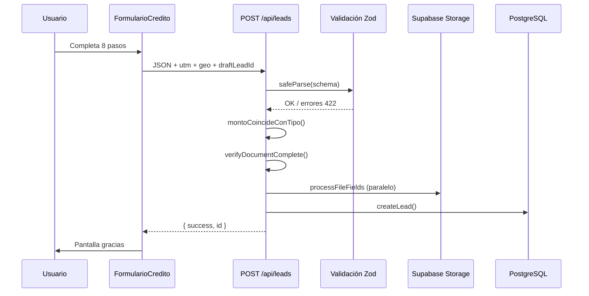
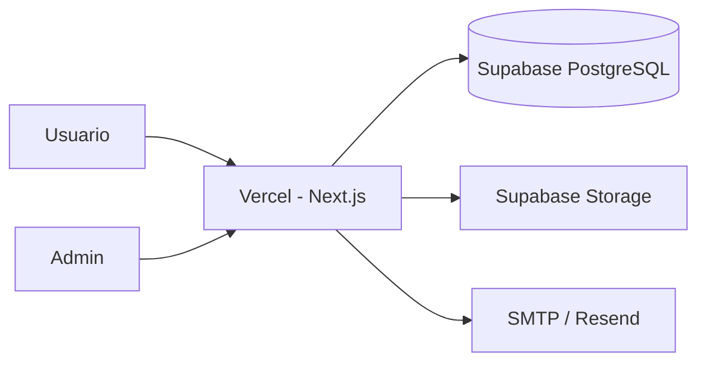

# Capacitación para desarrolladores — Coodelsur Landing

Guion y material de referencia para incorporar al equipo a quienes van a desarrollar los formularios **Microcrédito urbano** y **Microcrédito rural**. El formulario **Microcrédito Small** ya está en producción y es la referencia de arquitectura.

**Audiencia:** desarrolladores con experiencia en JavaScript/TypeScript y React (no se asume conocimiento previo de Next.js ni Prisma).

**Duración sugerida:** 2 sesiones de ~3 horas, o 1 jornada de 6 horas con pausas.

---

## Índice rápido

| Módulo | Tema | Duración |
|--------|------|----------|
| [1](#módulo-1--contexto-del-negocio-y-del-proyecto-30-min) | Contexto del negocio y del proyecto | 30 min |
| [2](#módulo-2--stack-tecnológico-y-conceptos-base-45-min) | Stack y conceptos base | 45 min |
| [3](#módulo-3--estructura-del-repositorio-30-min) | Estructura del repositorio | 30 min |
| [4](#módulo-4--base-de-datos-y-persistencia-45-min) | Base de datos y persistencia | 45 min |
| [5](#módulo-5--backend-y-api-45-min) | Backend y API | 45 min |
| [6](#módulo-6--formularios-frontend-60-min) | Formularios (frontend) | 60 min |
| [7](#módulo-7--panel-admin-y-operaciones-30-min) | Panel admin | 30 min |
| [8](#módulo-8--cómo-implementar-urbano-y-rural-60-min) | Implementar urbano/rural | 60 min |
| [9](#módulo-9--despliegue-seguridad-y-troubleshooting-30-min) | Despliegue y seguridad | 30 min |

**Documentos complementarios:** [README de docs](./README.md) · [Guía nuevo formulario](./GUIA-NUEVO-FORMULARIO.md) · [Arquitectura](./ARCHITECTURE.md)

---

## Antes de la sesión (preparación del facilitador)

### Checklist del entorno

Cada participante debe tener:

- [ ] Node.js 18+ instalado
- [ ] Git clonado: repositorio `coodelsur-landing`
- [ ] Editor con TypeScript (VS Code / Cursor recomendado)
- [ ] Docker Desktop **o** acceso a proyecto Supabase compartido
- [ ] Archivos `.env` y `.env.local` copiados desde los `.example`

```bash
cp .env.local.example .env.local
cp .env.example .env
npm install
npm run db:push
npm run dev
```

Verificar:

| URL | Resultado esperado |
|-----|-------------------|
| http://localhost:3000 | Landing + selector de monto |
| http://localhost:3000/admin | Login del panel |
| http://localhost:3000/api/health | `"database": true` |

Comando rápido: `npm run verify:backend`

### Material para compartir en pantalla

1. Diagrama de arquitectura ([ARCHITECTURE.md](./ARCHITECTURE.md))
2. `prisma/schema.prisma` — modelo `Lead`
3. `src/components/forms/FormularioCredito.tsx` — orquestador
4. `src/lib/validation/nanocredito.ts` — schema Zod
5. `src/app/api/leads/route.ts` — pipeline de envío

---

# MÓDULO 1 — Contexto del negocio y del proyecto (30 min)

## Guion para el facilitador

> **Abrir con:** “Coodelsur es una entidad de microcrédito en Colombia. Esta aplicación web captura solicitudes de crédito, las guarda en base de datos, almacena documentos adjuntos y permite al equipo comercial gestionarlas desde un panel admin.”

### Qué hace el producto hoy

| Funcionalidad | Estado |
|---------------|--------|
| Landing corporativa | ✅ Producción |
| Selector de monto unificado | ✅ Producción |
| Formulario Microcrédito Small ($200K–$600K) | ✅ Producción |
| Borradores incompletos (local + servidor) | ✅ Producción |
| Panel admin (listado, detalle, Excel, estados) | ✅ Producción |
| Adjuntos en Supabase Storage | ✅ Producción |
| Microcrédito urbano ($600K–$20M) | 🔜 Por implementar |
| Microcrédito rural ($1M–$5M) | 🔜 Por implementar |

### Regla de negocio clave: rangos de monto

| Producto | Rango (COP) | Formulario |
|----------|-------------|------------|
| Microcrédito Small | $200.000 – $600.000 | Disponible |
| Microcrédito urbano | $600.001 – $20.000.000 | Próximamente |
| Microcrédito rural | $1.000.000 – $5.000.000 | Próximamente |

**Detalle importante:** entre $1M y $5M el monto aplica a **urbano y rural**. El usuario debe elegir cuál producto quiere. La fuente de verdad está en `src/config/creditos/montos.ts`.

### Flujo del usuario (de punta a punta)

```
Landing → Elige monto → (si aplica) elige urbano/rural
       → Formulario multi-paso (8 pasos en Small)
       → Envío → Gracias
       → Lead visible en /admin/leads
```

### Ejercicio (5 min)

1. Abrir http://localhost:3000
2. Elegir monto $400.000 → debe abrir formulario Small
3. Elegir monto $2.000.000 → debe pedir urbano vs rural → pantalla “próximamente”
4. Completar una solicitud de prueba y verla en `/admin/leads`

### Preguntas para el grupo

- ¿Qué pasa si el usuario abandona a mitad del formulario?
- ¿Dónde ve el equipo comercial las solicitudes incompletas?

**Respuestas:** borrador en `localStorage` + registro en BD con `estado = incompleto`, visible en admin con filtro “Incompletas”.

---

# MÓDULO 2 — Stack tecnológico y conceptos base (45 min)

## Guion para el facilitador

> **Mensaje central:** “Es una sola aplicación Next.js que sirve tanto la interfaz web como las APIs. No hay un backend separado en otro lenguaje.”

### Tabla del stack

| Tecnología | Versión / nota | Para qué la usamos |
|------------|----------------|-------------------|
| **Next.js 14** | App Router | Páginas, rutas API, SSR/CSR |
| **TypeScript** | 5.x | Tipado en todo el proyecto |
| **React 18** | — | Componentes de UI |
| **Tailwind CSS** | 3.x | Estilos (clases `coodel-*`) |
| **React Hook Form** | 7.x | Estado del formulario multi-paso |
| **Zod** | 3.x | Validación cliente **y** servidor |
| **Prisma** | 5.x | ORM sobre PostgreSQL |
| **PostgreSQL** | Supabase en prod | Persistencia de leads |
| **Supabase Storage** | — | Cédula, video, firma |
| **Nodemailer / Resend** | opcional | Email de confirmación |

### Conceptos que deben quedar claros

#### Next.js App Router

```
src/app/
├── page.tsx              → GET /
├── solicitar/page.tsx    → GET /solicitar
├── admin/leads/page.tsx  → GET /admin/leads
└── api/
    └── leads/route.ts    → POST /api/leads
```

- Cada carpeta con `page.tsx` = una ruta visible en el navegador.
- Cada carpeta con `route.ts` dentro de `api/` = un endpoint HTTP.

#### Validación en dos capas

| Capa | Dónde | Por qué |
|------|-------|---------|
| Cliente | React Hook Form + Zod | UX inmediata al pulsar Continuar |
| Servidor | `POST /api/leads` | Seguridad — el cliente puede manipular datos |

**Nunca confiar solo en la validación del navegador.**

#### Server vs Client Components

- `"use client"` al inicio del archivo = componente que corre en el navegador (formularios, hooks, estado).
- Sin directiva = Server Component por defecto (páginas estáticas, fetch en servidor).

Los formularios (`FormularioCredito.tsx`, secciones) son **Client Components**.

### Ejercicio (10 min)

1. Abrir `package.json` — identificar dependencias principales.
2. Abrir DevTools → Network → enviar formulario → ver `POST /api/leads`.
3. Cambiar `NEXT_PUBLIC_DEMO_MODE=true` en `.env.local`, reiniciar dev — el formulario no persiste (solo consola).

### Recursos para profundizar (fuera de sesión)

- [Next.js App Router docs](https://nextjs.org/docs/app)
- [React Hook Form](https://react-hook-form.com/)
- [Zod](https://zod.dev/)
- [Prisma docs](https://www.prisma.io/docs)

---

# MÓDULO 3 — Estructura del repositorio (30 min)

## Guion para el facilitador

> “La lógica de negocio vive en `src/lib/`. Los componentes solo muestran UI y delegan.”

### Mapa visual

```
coodelsur-landing/
├── docs/                    ← Documentación (estás aquí)
├── prisma/
│   └── schema.prisma        ← Modelo de datos (Lead, CreditoParametros)
├── public/                  ← Imágenes, favicon, assets estáticos
├── scripts/                 ← verify-backend, generación de manuales Word
├── src/
│   ├── app/                 ← Páginas + API routes (Next.js)
│   ├── components/          ← UI reutilizable, landing, formularios
│   ├── config/creditos/     ← Productos, montos, amortización
│   ├── content/             ← Textos legales (hábeas data)
│   ├── contexts/            ← React Context (parámetros amortización)
│   ├── data/                ← Datos estáticos (bancos, departamentos)
│   ├── hooks/               ← Borradores local y servidor
│   ├── lib/                 ← ★ Lógica de negocio
│   └── types/               ← Tipos TypeScript compartidos
├── data/leads.json          ← Fallback local (gitignored, solo dev)
└── docker-compose.yml       ← PostgreSQL local opcional
```

### Capas de responsabilidad

| Capa | Ubicación | Ejemplo |
|------|-----------|---------|
| Presentación | `src/app/`, `src/components/` | `FormularioCredito.tsx` |
| API HTTP | `src/app/api/` | `leads/route.ts` |
| Dominio | `src/lib/leads/`, `src/lib/identity/` | `create-lead.ts` |
| Infraestructura | `src/lib/prisma.ts`, `src/lib/storage/` | Conexión DB, Storage |
| Configuración | `src/config/`, `.env` | Rangos de monto |

### Convenciones obligatorias del proyecto

1. **Lógica de negocio en `src/lib/`** — no en componentes ni en routes.
2. **Validación duplicada** — Zod en cliente y servidor.
3. **Adjuntos nunca en PostgreSQL** — solo paths/metadatos en JSON.
4. **Un componente por paso** del formulario en `sections/`.
5. **Reutilizar UI** — `Input`, `Select`, `FileUpload`, `SignaturePad`, etc.

### Ejercicio (10 min): recorrido guiado

Seguir este orden de lectura (15 min cada archivo en parejas):

1. `src/components/solicitud/SolicitudUnificada.tsx` — entrada UX
2. `src/config/creditos/montos.ts` — reglas de monto
3. `src/lib/leads/create-lead.ts` — qué pasa al guardar

Referencia completa: [CODEBASE.md](./CODEBASE.md)

---

# MÓDULO 4 — Base de datos y persistencia (45 min)

## Guion para el facilitador

> “Un solo modelo principal (`Lead`) guarda todas las solicitudes de todos los productos. El detalle completo del formulario va en un campo JSON.”

### Diagrama del modelo



### Modelo `Lead` — campos importantes

| Campo | Tipo | Propósito |
|-------|------|-----------|
| `id` | UUID | Identificador único |
| `tipoCredito` | String | `microcredito_small`, `microcredito_urbano`, etc. |
| `nombre`, `cedula`, `telefono` | String | Desnormalizados para listado admin rápido |
| `capitalSolicitado` | Int | Monto en COP — sin leer JSON |
| `progresoFormulario` | Int | 0–100 para borradores incompletos |
| `pasoActualFormulario` | String | ID del paso (ej. `credito`, `domicilio`) |
| `datosFormulario` | JSON | **Payload completo** + metadata de adjuntos |
| `estado` | Enum | Workflow comercial (ver abajo) |
| `utmSource`, `utmCampaign`, … | String? | Tracking de campañas |
| `latitud`, `longitud` | Float? | Geolocalización del cliente |

Archivo: `prisma/schema.prisma`

### Estados del lead (`LeadEstado`)

| Estado | Significado | Cuándo |
|--------|-------------|--------|
| `incompleto` | Borrador abandonado | Usuario dejó datos mínimos |
| `recibido` | Solicitud enviada | Formulario completo |
| `revisado` | Revisión interna | Admin cambia estado |
| `contactado` | Asesor contactó | Admin cambia estado |
| `descartado` | No procede | Admin cambia estado |

### Modelo `CreditoParametros`

Parámetros de amortización editables desde **Admin → Parámetros**:

- Tasa mensual, fianza, vida deudores, plazos permitidos
- Un registro por `tipoCredito`
- El formulario los carga vía `/api/creditos/parametros`

### Por qué campos desnormalizados + JSON

| Necesidad | Solución |
|-----------|----------|
| Listado admin rápido (miles de filas) | Columnas `nombre`, `cedula`, `capitalSolicitado`, `progresoFormulario` |
| Detalle completo + campos variables por producto | `datosFormulario` JSON |
| Adjuntos pesados | Supabase Storage — solo path en JSON |

### Prisma — comandos del día a día

```bash
npm run db:push      # Sincronizar schema → PostgreSQL (dev/staging)
npm run db:studio    # Explorador visual de datos
npx prisma generate  # Regenerar cliente (postinstall lo hace solo)
```

### Conexión: local vs producción

| Entorno | DATABASE_URL | Notas |
|---------|--------------|-------|
| Docker local | `localhost:5432` | `docker compose up -d` |
| Supabase prod | Transaction pooler **:6543** | `?pgbouncer=true` |
| Migraciones Prisma | DIRECT_URL **:5432** | Solo en Supabase |

Guía completa: [BACKEND_SETUP.md](./BACKEND_SETUP.md)

### Ejercicio (15 min)

1. `npm run db:studio` → explorar tabla `Lead`
2. Enviar solicitud de prueba → ver fila nueva
3. Abrir `datosFormulario` → identificar campos del formulario
4. Filtrar por `estado = incompleto` → ver borradores

### Pregunta de evaluación

> “¿Necesitamos migración Prisma para agregar el formulario urbano?”

**Respuesta:** No, si los campos nuevos van dentro de `datosFormulario` JSON. Solo migrar si negocio pide columnas indexadas propias.

---

# MÓDULO 5 — Backend y API (45 min)

## Guion para el facilitador

> “Las API routes de Next.js son el backend. Orquestan validación, identidad, Storage y persistencia.”

### Diagrama de flujo — envío completo



### Endpoints principales

| Método | Ruta | Auth | Descripción |
|--------|------|------|-------------|
| GET | `/api/health` | No | Diagnóstico DB + Storage |
| POST | `/api/leads/draft` | No | Borrador incompleto |
| POST | `/api/leads` | No | Solicitud completa |
| POST | `/api/verify-cedula` | No | Validación documento paso 1 |
| POST | `/api/admin/login` | No | Login panel |
| GET | `/api/admin/leads` | Cookie admin | Listado |
| GET/PATCH/DELETE | `/api/admin/leads/[id]` | Cookie admin | Detalle, estado, borrar |

Referencia: [API.md](./API.md)

### Pipeline de `POST /api/leads` (paso a paso)

Archivo: `src/app/api/leads/route.ts`

1. **Parse body** — JSON del formulario + `utm`, `geoCliente`, `draftLeadId`
2. **Resolver `tipoCredito`** — alias `nanocredito` → `microcredito_small`
3. **Elegir schema Zod** — por producto (`nanocreditoSchema` para Small)
4. **Validar** — `safeParse` → 422 si falla
5. **Verificar monto** — `montoCoincideConTipo()` → anti-manipulación
6. **Verificar cédula** — formato, duplicados, opcional Verifik/Registraduría
7. **Subir adjuntos** — Storage en paralelo (`processFileFields`)
8. **Persistir** — `createLead()` inserta o actualiza borrador existente
9. **Email** — confirmación si SMTP/Resend configurado

### Borrador incompleto — `POST /api/leads/draft`

Archivo: `src/lib/leads/save-draft-lead.ts`

- Guarda cada ~2 segundos y al cambiar de paso (hook `useNanocreditoServerDraft`)
- Requiere mínimo: celular válido, cédula válida, o nombre+email
- Estado `incompleto`, progreso calculado en `form-progress.ts`
- Deduplicación por cédula/teléfono — no crea filas duplicadas
- Al completar formulario, **mismo registro** pasa a `recibido`

### Adjuntos — regla de oro

| Qué | Dónde |
|-----|-------|
| Binarios (imagen, video, firma) | Supabase Storage bucket `lead-attachments` |
| Metadatos (fileName, path, mimeType) | Campo JSON `datosFormulario` |
| Descarga en admin | Proxy `/api/admin/leads/[id]/attachments/[field]` |

**Nunca guardar base64 grande en PostgreSQL.**

### Fallback de desarrollo

Si PostgreSQL no responde:

- `create-lead` y `save-draft-lead` pueden escribir en `data/leads.json`
- Variable `LEAD_STORE=file` fuerza modo archivo
- **Prohibido en producción**

### Ejercicio (15 min)

1. DevTools → enviar formulario → inspeccionar request/response de `POST /api/leads`
2. Enviar POST manual con Postman/curl con monto fuera de rango → debe dar 422
3. `GET /api/health` — interpretar cada campo

### Código de referencia

```
src/app/api/leads/route.ts          ← Orquestación HTTP
src/lib/leads/create-lead.ts        ← Persistencia + Storage
src/lib/leads/save-draft-lead.ts    ← Borradores
src/lib/storage/upload.ts           ← Supabase Storage
src/lib/identity/cedula.ts          ← Validación CC
```

---

# MÓDULO 6 — Formularios (frontend) (60 min)

## Guion para el facilitador

> “El formulario Small es la plantilla. Urbano y rural deben seguir el mismo patrón: orquestador + secciones + schema Zod + hooks de borrador.”

### Arquitectura del formulario Small

```
FormularioCredito.tsx          ← Orquestador (pasos, Continuar/Atrás, envío)
├── FormProvider (React Hook Form)
├── ParametrosAmortizacionProvider
├── STEP_COMPONENTS[0..7]      ← Una sección por paso
│   ├── SeccionDatosGenerales
│   ├── SeccionDatosCredito
│   ├── SeccionDomicilio
│   ├── SeccionActivos
│   ├── SeccionLaboral
│   ├── SeccionReferenciaFamiliar
│   ├── SeccionDatosBancarios
│   └── SeccionVerificacion
├── useNanocreditoDraft          ← localStorage
└── useNanocreditoServerDraft    ← POST /api/leads/draft
```

### Los 8 pasos (`NANOCREDITO_STEPS`)

| # | ID | Contenido principal |
|---|-----|---------------------|
| 1 | `general` | Nombre, email, documento, celular |
| 2 | `credito` | Monto, cuotas, destino, ingresos |
| 3 | `domicilio` | Departamento, municipio, dirección |
| 4 | `activos` | Vivienda, vehículo, placa condicional |
| 5 | `laboral` | Ocupación, empresa |
| 6 | `referencia` | Referencia familiar/personal |
| 7 | `bancarios` | Cuenta o llave Bre-B |
| 8 | `verificacion` | Cédula, video, firma, términos |

Definición: `src/lib/validation/nanocredito.ts`

### Patrón de una sección

Cada `Seccion*.tsx`:

```tsx
"use client";
import { useFormContext } from "react-hook-form";
import type { NanocreditoFormValues } from "@/shared/validation/nanocredito";

export function SeccionEjemplo() {
  const { register, formState: { errors } } = useFormContext<NanocreditoFormValues>();
  return (
    <div>
      <input {...register("campo")} />
      {errors.campo && <span>{errors.campo.message}</span>}
    </div>
  );
}
```

- Usa `useFormContext` — no props drilling de cada campo.
- No hace `fetch` al enviar — eso lo hace el orquestador.
- Campos condicionales: `watch("tieneVehiculo")` para mostrar/ocultar.

### Validación por paso

Al pulsar **Continuar**:

1. `trigger(fieldsDelPaso)` — valida campos Zod del paso actual
2. `collectStepCrossFieldErrors()` — reglas que cruzan campos (ej. placa si tiene vehículo)
3. Si OK → avanza al siguiente paso + guarda borrador

Reglas cruzadas globales al **Enviar**: `collectCrossFieldErrors()`

### Componentes reutilizables

| Componente | Uso |
|------------|-----|
| `Input`, `Select`, `CurrencyInput` | Campos básicos |
| `FileUpload` | Archivo imagen/PDF |
| `CameraCapture` | Foto cédula desde cámara |
| `VideoRecorder` | Video de verificación (15 MB max) |
| `SignaturePad` | Firma digital |
| `TermsAcceptance` | Hábeas data + términos |

### Amortización en el formulario

- `ParametrosAmortizacionProvider` carga parámetros de BD
- `calcularDesgloseCuota(tipo, monto, cuotas, parametros)` actualiza cuota automáticamente
- Ver `SeccionDatosCredito.tsx` como ejemplo

### Borradores — dos capas

| Capa | Hook | Almacenamiento | Recuperación |
|------|------|----------------|--------------|
| Local | `useNanocreditoDraft` | `localStorage` | Al recargar pestaña |
| Servidor | `useNanocreditoServerDraft` | PostgreSQL | Visible en admin |

### Ejercicio práctico (25 min)

**Ejercicio A — Lectura:** Abrir `SeccionActivos.tsx` y encontrar la lógica condicional de placa.

**Ejercicio B — Trazado:** Poner breakpoint o `console.log` en `handleContinue` de `FormularioCredito.tsx` y seguir el flujo al pulsar Continuar en paso 4 (activos) sin placa con vehículo = sí.

**Ejercicio C — Validación:** En paso 1, probar cédula con 8 dígitos → debe rechazar (solo 6, 7 o 10).

Referencia funcional: [FORMULARIO.md](./FORMULARIO.md)

---

# MÓDULO 7 — Panel admin y operaciones (30 min)

## Guion para el facilitador

> “El admin es para el equipo comercial de Coodelsur. Como devs, debemos asegurar que los nuevos campos se vean bien en listado, detalle y Excel.”

### Acceso

- URL: `/admin`
- Contraseña: variable `ADMIN_PASSWORD`
- Sesión: cookie HTTP-only `coodelsur_admin` (12 h)

### Pantallas

| Ruta | Función |
|------|---------|
| `/admin/leads` | Listado, búsqueda, filtros, export Excel |
| `/admin/leads/[id]` | Detalle, adjuntos, cambio de estado, eliminar |
| `/admin/parametros` | Tasas y plazos por producto |

### Operaciones del equipo comercial

| Acción | Cómo |
|--------|------|
| Ver nuevas solicitudes | Filtro `recibido` |
| Contactar abandonos | Filtro `Incompletas` |
| Exportar a Excel | Selección múltiple o informe general |
| Eliminar solicitud errónea | Detalle → Eliminar |
| Cambiar estado | Select en detalle |

Referencia: [ADMIN.md](./ADMIN.md)

### Qué tocar al agregar formulario urbano/rural

| Archivo | Acción |
|---------|--------|
| `src/lib/leads/admin-lead-sections.ts` | Mostrar campos nuevos en detalle |
| `src/lib/leads/export-leads-excel.ts` | Columnas nuevas en Excel |
| Filtro en listado | Ya filtra por `tipoCredito` |

### Rendimiento (no romper)

- Listado: solo columnas desnormalizadas — no cargar JSON completo
- Detalle: ~1–2 KB — adjuntos vía proxy separado
- Fetch admin siempre con `cache: 'no-store'`

### Ejercicio (10 min)

1. Login en `/admin`
2. Buscar solicitud de prueba por cédula
3. Cambiar estado a `revisado`
4. Exportar Excel — verificar columnas
5. Ver adjunto (cédula/video) en detalle

---

# MÓDULO 8 — Cómo implementar urbano y rural (60 min)

## Guion para el facilitador

> “No parten de cero. El backend, el modelo Lead, Storage y admin ya soportan múltiples productos. El trabajo principal es definir campos con negocio e implementar UI + validaciones.”

### Lo que ya está preparado

| Elemento | Ubicación | Estado |
|----------|-----------|--------|
| Tipos `microcredito_urbano` / `microcredito_rural` | `src/types/credito.ts` | ✅ |
| Rangos de monto | `src/config/creditos/montos.ts` | ✅ (`formularioDisponible: false`) |
| API acepta tipos urbano/rural | `leadApiSchema` | ✅ |
| Tabla `CreditoParametros` | Prisma + admin | ✅ |
| Pantalla “próximamente” | `SolicitudUnificada.tsx` | ✅ |

### Lo que falta implementar

1. Definición de campos/pasos con negocio (documento Excel/PDF)
2. Schema Zod dedicado (`microcredito-urbano.ts`, `microcredito-rural.ts`)
3. Orquestador de formulario (`FormularioMicrocreditoUrbano.tsx`, etc.)
4. Secciones UI (reutilizar las del Small donde aplique)
5. Hooks de borrador (duplicar o generalizar)
6. Dispatch en `SolicitudUnificada.tsx`
7. Branch de schema en `api/leads/route.ts` y `draft/route.ts`
8. Admin: secciones y columnas Excel si hay campos nuevos

### Checklist por fases

#### Fase A — Definición (con negocio)

- [ ] Lista oficial de campos, pasos y reglas condicionales
- [ ] Plazos y fórmula de amortización definitiva
- [ ] Adjuntos requeridos (¿mismos que Small?)
- [ ] ¿Formulario compartido urbano/rural con variaciones o totalmente distintos?

#### Fase B — Configuración

- [ ] Crear `src/config/creditos/urbano.ts` y/o `rural.ts`
- [ ] Registrar en `src/config/creditos/index.ts` con `disponible: true`
- [ ] En `montos.ts`: `formularioDisponible: true`

#### Fase C — Validación

Crear `src/lib/validation/microcredito-urbano.ts`:

```typescript
export const MICROCREDITO_URBANO_STEPS = [ /* id, title, fields */ ];
export const microcreditoUrbanoSchema = z.object({ /* ... */ });
export const microcreditoUrbanoDefaultValues = { /* ... */ };
export function collectStepCrossFieldErrors(/* ... */) { /* ... */ }
```

En `src/app/api/leads/route.ts`:

```typescript
const formSchema =
  tipoCanonico === "microcredito_small"
    ? nanocreditoSchema
    : tipoCanonico === "microcredito_urbano"
      ? microcreditoUrbanoSchema
      : tipoCanonico === "microcredito_rural"
        ? microcreditoRuralSchema
        : buildFormSchema(tipoCanonico);
```

#### Fase D — UI

En `SolicitudUnificada.tsx`:

```tsx
{resolucion.rango.tipo === "microcredito_small" && (
  <FormularioCredito config={config} initialMonto={resolucion.monto} />
)}
{resolucion.rango.tipo === "microcredito_urbano" && (
  <FormularioMicrocreditoUrbano config={config} initialMonto={resolucion.monto} />
)}
```

#### Fase E — Activación

- [ ] Probar montos límite min/max
- [ ] Probar solape $1M–$5M (urbano vs rural)
- [ ] Envío completo + borrador + admin + Excel
- [ ] `NEXT_PUBLIC_DEMO_MODE=false` en staging

### Orden sugerido de implementación (para el dev)

```
1. Definir STEPS + schema Zod (sin UI)
2. Crear orquestador mínimo con 1–2 secciones
3. Conectar API (branch de schema)
4. Activar en montos.ts + SolicitudUnificada
5. Completar secciones restantes
6. Borradores
7. Admin + Excel
8. Pruebas E2E
```

### Errores comunes

| Problema | Causa |
|----------|-------|
| Formulario no aparece | `formularioDisponible: false` en montos.ts |
| 422 “monto no corresponde” | `capitalSeleccionado` fuera de rango |
| Cuotas no cargan | Parámetros no sembrados en `/admin/parametros` |
| Adjuntos no se ven | Storage mal configurado |

Guía detallada: [GUIA-NUEVO-FORMULARIO.md](./GUIA-NUEVO-FORMULARIO.md)

### Ejercicio final (30 min) — taller

**Objetivo:** Preparar el esqueleto del formulario urbano (sin completar todos los campos).

1. Crear `src/lib/validation/microcredito-urbano.ts` con 2 pasos y schema mínimo
2. Crear `FormularioMicrocreditoUrbano.tsx` copiando estructura de `FormularioCredito.tsx`
3. Agregar branch en `SolicitudUnificada.tsx`
4. Poner `formularioDisponible: true` solo en dev (branch local)
5. Probar monto $1.000.000 → urbano → formulario abre

*(En producción real, esperar definición de negocio antes de activar.)*

---

# MÓDULO 9 — Despliegue, seguridad y troubleshooting (30 min)

## Guion para el facilitador

> “Producción = Vercel + Supabase. Hay variables que si están mal, el sitio ‘funciona’ pero no guarda nada real.”

### Infraestructura de producción



### Variables críticas

| Variable | Producción | Error si está mal |
|----------|------------|-------------------|
| `DATABASE_URL` | Pooler :6543 | No guarda leads |
| `NEXT_PUBLIC_DEMO_MODE` | **`false`** | Formulario no persiste |
| `LEAD_STORE` | **vacío** | Escribe JSON local |
| `ADMIN_PASSWORD` | Fuerte, única | Panel inseguro |
| `SUPABASE_*` | Configurado | Sin adjuntos |

### Seguridad

| Recurso | Protección |
|---------|------------|
| Panel admin | Cookie firmada |
| APIs admin | Middleware en cada route |
| Storage | Service role solo en servidor; admin usa proxy |
| Manipulación de monto/tipo | `montoCoincideConTipo()` en API |
| Webhook Witme | Bearer `WITME_API_KEY` |

### Checklist post-deploy

1. `GET /api/health` → `database: true`, `demoMode: false`
2. Solicitud de prueba real
3. Ver en `/admin/leads`
4. Adjuntos en Storage

Guía: [DESPLIEGUE.md](./DESPLIEGUE.md)

### Troubleshooting frecuente

| Error | Causa | Solución |
|-------|-------|----------|
| `P1001` localhost:5432 | PostgreSQL no corre | Docker o Supabase |
| Admin vacío con datos | Caché navegador | Ctrl+Shift+R |
| Lentitud admin | Pooler incorrecto | Puerto 6543 |
| Storage error | Clave mal configurada | Revisar `SUPABASE_SERVICE_ROLE_KEY` |
| Hot reload raro | Caché Next | Borrar `.next`, reiniciar dev |

### Comandos útiles

```bash
npm run dev              # Desarrollo
npm run build            # Build producción
npm run verify:backend   # Health check
npm run db:studio        # Explorar datos
```

---

# Anexo A — Plan de sesión sugerido (1 jornada)

| Hora | Módulo | Actividad |
|------|--------|-----------|
| 09:00 – 09:30 | 1 | Contexto + demo del producto |
| 09:30 – 10:15 | 2 | Stack + conceptos Next/React/Zod |
| 10:15 – 10:30 | — | Pausa |
| 10:30 – 11:00 | 3 | Tour del repositorio |
| 11:00 – 11:45 | 4 | Base de datos + Prisma Studio |
| 11:45 – 12:30 | 5 | API + flujo de envío |
| 12:30 – 13:30 | — | Almuerzo |
| 13:30 – 14:30 | 6 | Formularios + ejercicios |
| 14:30 – 15:00 | 7 | Panel admin |
| 15:00 – 15:15 | — | Pausa |
| 15:15 – 16:15 | 8 | Taller urbano/rural |
| 16:15 – 16:45 | 9 | Despliegue + Q&A |

---

# Anexo B — Plan de sesión en 2 partes

### Sesión 1 (3 h) — Fundamentos

Módulos 1–5: contexto, stack, estructura, base de datos, backend.

**Entregable:** cada dev con entorno local funcionando y una solicitud de prueba en admin.

### Sesión 2 (3 h) — Formularios e implementación

Módulos 6–9: formularios, admin, taller urbano/rural, despliegue.

**Entregable:** esqueleto de formulario urbano en branch local (ejercicio del módulo 8).

---

# Anexo C — Preguntas frecuentes del equipo nuevo

### ¿Por qué Next.js y no un backend separado (Express, Nest)?

Un solo repo, un solo deploy, tipos compartidos entre frontend y API. Para este alcance (landing + formularios + admin) es más simple de mantener.

### ¿Por qué JSON en `datosFormulario` y no una tabla por campo?

Cada producto puede tener campos distintos sin migraciones constantes. Las columnas desnormalizadas cubren lo que el admin necesita en listados.

### ¿Puedo probar sin Supabase?

Sí: Docker (`docker compose up -d`) o fallback `LEAD_STORE=file` (solo dev, sin adjuntos reales en Storage).

### ¿Cómo sé qué campos lleva urbano/rural?

Debe venir de negocio/Coodelsur en documento oficial. Referencia de formato: `docs/formulario-microcredito-small-campos-witme.docx`.

### ¿Integración Witme aplica ya?

Fase posterior. Ver [WITME_FORMULARIO.md](./WITME_FORMULARIO.md) y [WITME_API.md](./WITME_API.md).

### ¿Quién aprueba activar un formulario en producción?

Coodelsur (negocio) confirma campos + tasas → dev pone `formularioDisponible: true` → QA en staging → deploy.

---

# Anexo D — Ruta de aprendizaje post-capacitación (1ª semana)

| Día | Tarea | Documento |
|-----|-------|-----------|
| 1 | Entorno local + enviar solicitud completa | [BACKEND_SETUP.md](./BACKEND_SETUP.md) |
| 2 | Leer flujo monto + SolicitudUnificada | [FLUJO_MONTO.md](./FLUJO_MONTO.md) |
| 3 | Estudiar FormularioCredito + nanocredito.ts | [FORMULARIO.md](./FORMULARIO.md) |
| 4 | Trazar POST /api/leads + create-lead.ts | [API.md](./API.md), [ARCHITECTURE.md](./ARCHITECTURE.md) |
| 5 | Explorar admin + export Excel | [ADMIN.md](./ADMIN.md) |
| 6–7 | Empezar schema urbano con definición de negocio | [GUIA-NUEVO-FORMULARIO.md](./GUIA-NUEVO-FORMULARIO.md) |

---

# Anexo E — Glosario

| Término | Significado |
|---------|-------------|
| **Lead** | Solicitud de crédito (registro en BD) |
| **Borrador incompleto** | Lead con `estado = incompleto` |
| **Orquestador** | Componente que maneja pasos y envío (`FormularioCredito`) |
| **Schema Zod** | Definición de validación de campos |
| **Regla cruzada** | Validación que depende de más de un campo |
| **Desnormalizado** | Campo duplicado en columna propia para consultas rápidas |
| **Pooler** | Connection pooler de Supabase (puerto 6543) para serverless |
| **Proxy de adjuntos** | API admin que sirve archivos desde Storage sin exponer claves |

---

**Última actualización:** septiembre 2026 · Mantener sincronizado con [docs/README.md](./README.md)
