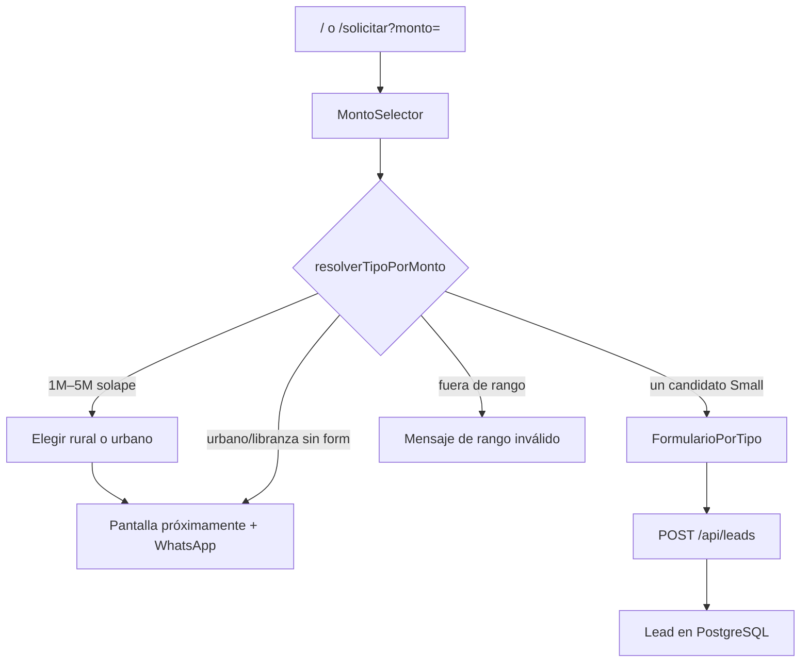

# Flujo unificado por monto

## Objetivo

El usuario elige **cuánto dinero necesita**. El sistema clasifica el producto.
Solo entre $1M y $5M puede pedir confirmación (rural vs urbano).

## Reglas de negocio (oficiales)

| Producto | Monto (COP) | Formulario |
|----------|-------------|------------|
| Microcrédito Small | $200.000 – $600.000 | Disponible |
| Microcrédito urbano | $600.001 – $20.000.000 | Próximamente |
| Crédito Libranza | $1.000.000 – $5.000.000 | Próximamente |

Nota: $600.000 queda en Small (“hasta 600.000”). Urbano arranca en $600.001.
Entre $1M y $5M hay solape libranza/urbano → el usuario elige.

Fuente de verdad: `src/shared/config/creditos/montos.ts`

## Flujo UX



1. Landing `/` o `/solicitar` muestra el selector de monto.
2. Al continuar, `SolicitudUnificada` decide la fase.
3. Si el producto tiene formulario activo, abre `FormularioPorTipo` con monto precargado.
4. La API valida de nuevo que el monto coincida con `tipoCredito`.

## Archivos clave

| Capa | Archivo | Rol |
|------|---------|-----|
| Config | `src/shared/config/creditos/montos.ts` | Rangos + detección |
| UI | `src/presentation/components/solicitud/MontoSelector.tsx` | Entrada de monto |
| UI | `src/presentation/components/solicitud/SolicitudUnificada.tsx` | Orquestación |
| Form | `src/presentation/components/forms/registry.tsx` | Dispatch por producto |
| API | `src/app/api/leads/route.ts` | `montoCoincideConTipo` |

## Campañas / redirecciones

```
https://tu-dominio.com/solicitar?monto=400000
```

El query `monto` precarga el selector (aún debe confirmar Continuar).

Rutas por producto: ver `src/shared/config/creditos/formularios.ts`

## Extender a rural / urbano

Ver [GUIA-NUEVO-FORMULARIO.md](./GUIA-NUEVO-FORMULARIO.md).

## Seguridad

La API rechaza el request si `capitalSeleccionado` no está dentro del rango del tipo declarado (`montoCoincideConTipo`).
