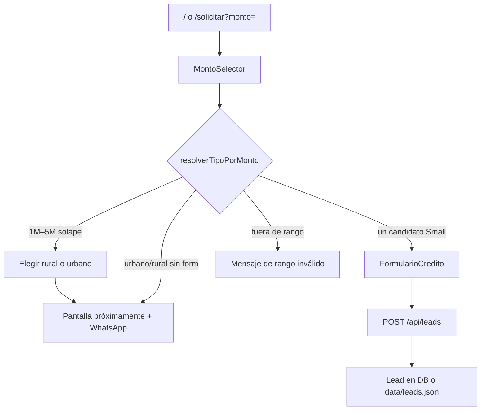

# Flujo unificado por monto

## Objetivo

El usuario elige **cuánto dinero necesita**. El sistema clasifica el producto.
Solo entre $1M y $5M puede pedir confirmación (rural vs urbano).

## Reglas de negocio (oficiales)

| Producto | Monto (COP) | Formulario |
|----------|-------------|------------|
| Microcrédito Small | $200.000 – $600.000 | Disponible |
| Microcrédito urbano | $600.001 – $20.000.000 | Próximamente |
| Microcrédito rural | $1.000.000 – $5.000.000 | Próximamente |

Nota: $600.000 queda en Small (“hasta 600.000”). Urbano arranca en $600.001.
Entre $1M y $5M hay solape rural/urbano → el usuario elige.

Fuente de verdad: [`src/config/creditos/montos.ts`](../src/config/creditos/montos.ts)

## Flujo UX



1. Landing `/` o `/solicitar` muestra el selector de monto.
2. Al continuar, `SolicitudUnificada` decide la fase.
3. Si es Microcrédito Small, abre el formulario con el monto precargado.
4. La API valida de nuevo que el monto coincida con `tipoCredito`.

## Archivos clave

| Capa | Archivo | Rol |
|------|---------|-----|
| Config | `src/config/creditos/montos.ts` | Rangos + detección |
| UI | `src/components/solicitud/MontoSelector.tsx` | Entrada de monto + elección |
| UI | `src/components/solicitud/SolicitudUnificada.tsx` | Orquestación |
| Form | `src/components/forms/FormularioCredito.tsx` | `initialMonto` |
| API | `src/app/api/leads/route.ts` | `montoCoincideConTipo` |
| Validación | `src/lib/validation/nanocredito.ts` | Schema Small (literal `microcredito_small`) |

## Campañas / redirecciones

```
https://tu-dominio.com/solicitar?monto=400000
```

El query `monto` precarga el selector (aún debe confirmar Continuar).
Slug histórico `/credito/nanocredito` sigue resolviendo a Microcrédito Small.

## Extender a rural / urbano

1. Implementar formulario + schema del producto.
2. En `montos.ts`, poner `formularioDisponible: true`.
3. En `SolicitudUnificada` / `FormularioCredito`, resolver el componente según `rango.tipo`.
4. En la API, mapear el schema como con `microcredito_small`.

## Seguridad

El cliente puede alterar `tipoCredito` en el JSON. La API rechaza el request si
`capitalSeleccionado` no está dentro del rango del tipo declarado
(`montoCoincideConTipo`).
