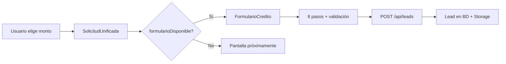

# Guía para desarrollar un nuevo formulario de crédito

Documento de onboarding para quien va a implementar el **Microcrédito urbano** o **Crédito Libranza**. El formulario **Microcrédito Small** ya está en producción y sirve como referencia de arquitectura, patrones y convenciones.

---

## 1. Qué hay hoy y qué falta

| Producto | Monto (COP) | Formulario | Estado |
|----------|-------------|------------|--------|
| Microcrédito Small | $200.000 – $600.000 | ✅ Publicado | Referencia completa |
| Microcrédito urbano | $600.001 – $20.000.000 | ❌ | Por implementar |
| Crédito Libranza | $1.000.000 – $5.000.000 | ❌ | Por implementar |

**Regla de negocio importante:** entre $1M y $5M el monto aplica tanto a urbano como a rural. El usuario debe elegir cuál producto quiere (`MontoSelector` ya maneja esa ambigüedad).

**Fuente de verdad de rangos:** `src/config/creditos/montos.ts`

Cuando el formulario esté listo, hay que poner `formularioDisponible: true` en el rango correspondiente y conectar el componente en el flujo unificado.

---

## 2. Arranque del entorno (primer día)

```bash
cp .env.example .env
cp .env.example .env.local
# Completar DATABASE_URL, DIRECT_URL, SUPABASE_*, ADMIN_PASSWORD
npm install
npm run db:push
npm run dev
```

| URL | Para qué |
|-----|----------|
| http://localhost:3000 | Landing + selector de monto + formulario Small |
| http://localhost:3000/solicitar?monto=400000 | Probar precarga de monto |
| http://localhost:3000/admin | Panel admin (leads, parámetros, export Excel) |
| http://localhost:3000/api/health | Verificar DB y Storage |

**Modo demo:** con `NEXT_PUBLIC_DEMO_MODE=true` el formulario no guarda en BD (solo consola). Para desarrollo real usar `false`.

**Verificación rápida:** `npm run verify:backend`

Documentación complementaria:
- [BACKEND_SETUP.md](./BACKEND_SETUP.md) — Supabase, Docker, variables
- [HEXAGONAL.md](./HEXAGONAL.md) — capas y flujos
- [CODEBASE.md](./CODEBASE.md) — mapa de archivos
- [FORMULARIO.md](./FORMULARIO.md) — detalle del Small actual
- [FLUJO_MONTO.md](./FLUJO_MONTO.md) — selector y resolución por monto

---

## 3. Stack y convenciones del proyecto

| Tecnología | Uso en formularios |
|------------|-------------------|
| Next.js 14 App Router | Páginas + API routes |
| React Hook Form | Estado del formulario multi-paso |
| Zod | Validación cliente y servidor |
| Tailwind CSS | Estilos (clases `coodel-*`) |
| Prisma + PostgreSQL | Persistencia de leads |
| Supabase Storage | Adjuntos (cédula, video, firma) |

**Convenciones obligatorias:**

1. **Lógica de negocio en `src/lib/`**, no en componentes ni en routes.
2. **Validación duplicada:** Zod en cliente (UX) + misma validación en `POST /api/leads` (seguridad).
3. **Adjuntos nunca en PostgreSQL** — solo paths/metadatos en el JSON `datosFormulario`.
4. **Un componente por paso** en `src/components/forms/sections/`.
5. **Reutilizar UI existente:** `Input`, `Select`, `CurrencyInput`, `FileUpload`, `SignaturePad`, `VideoRecorder`, `CameraCapture`.

---

## 4. Cómo funciona el formulario Small (modelo a seguir)

### 4.1 Flujo de usuario



Archivos del flujo:
- `src/components/solicitud/MontoSelector.tsx` — entrada de monto
- `src/components/solicitud/SolicitudUnificada.tsx` — decide formulario vs “próximamente”
- `src/components/forms/FormularioCredito.tsx` — orquestador multi-paso

### 4.2 Capas del formulario Small

| Capa | Archivo | Responsabilidad |
|------|---------|-----------------|
| Orquestador | `FormularioCredito.tsx` | Pasos, Continuar/Atrás, envío, borradores |
| Secciones UI | `sections/Seccion*.tsx` | Campos de cada paso |
| Schema + pasos | `lib/validation/nanocredito.ts` | Zod, `NANOCREDITO_STEPS`, reglas cruzadas |
| Config producto | `config/creditos/nanocredito.ts` | Metadata del producto |
| Amortización | `lib/credito/amortizacion.ts` | Cálculo de cuota, fianza, etc. |
| Borrador local | `hooks/useNanocreditoDraft.ts` | `localStorage` |
| Borrador servidor | `hooks/useNanocreditoServerDraft.ts` | `POST /api/leads/draft` |
| API envío | `app/api/leads/route.ts` | Validación + identidad + `create-lead` |

### 4.3 Los 8 pasos actuales (Small)

Definidos en `NANOCREDITO_STEPS` (`nanocredito.ts`):

| # | ID | Sección |
|---|-----|---------|
| 1 | `general` | Datos generales |
| 2 | `credito` | Monto, cuotas, destino, ingresos |
| 3 | `domicilio` | Ubicación |
| 4 | `activos` | Vivienda, vehículo, placa |
| 5 | `laboral` | Ocupación, empresa |
| 6 | `referencia` | Referencia familiar/personal |
| 7 | `bancarios` | Cuenta o llave Bre-B |
| 8 | `verificacion` | Cédula, video, firma, términos |

El botón **Continuar** valida solo los campos del paso actual (`trigger`) y luego aplica reglas cruzadas (`collectStepCrossFieldErrors`).

### 4.4 Patrón de una sección

Cada `Seccion*.tsx`:
- Usa `useFormContext<T>()` (tipado con el schema del producto).
- Registra campos con `register` o `Controller`.
- Muestra errores desde `formState.errors`.
- No hace fetch directo al enviar; eso lo hace el orquestador.

Ejemplo de referencia: `SeccionDatosCredito.tsx` (monto, cuotas, desglose automático con amortización).

### 4.5 Envío al backend

`FormularioCredito` hace `POST /api/leads` con:
- Todos los campos del formulario
- `tipoCredito` (hidden)
- `utm` (cookie de campaña)
- `draftLeadId` (si venía de borrador incompleto)
- `geoCliente` (coordenadas si el usuario las compartió)

La API (`route.ts`):
1. Valida schema Zod del producto
2. Verifica que `capitalSeleccionado` coincida con `tipoCredito` (`montoCoincideConTipo`) — **no confiar en el cliente**
3. Verifica cédula (formato + duplicados + opcional Verifik)
4. Sube adjuntos a Storage en paralelo
5. Guarda/actualiza `Lead` en PostgreSQL

---

## 5. Qué ya está preparado para urbano/libranza

No partes de cero. El proyecto ya tiene stubs y defaults:

| Qué | Dónde | Estado |
|-----|-------|--------|
| Tipos `microcredito_urbano` / `libranza` | `src/types/credito.ts` | ✅ |
| Rangos de monto | `src/config/creditos/montos.ts` | ✅ (`formularioDisponible: false`) |
| Catálogo de productos | `src/config/creditos/index.ts` | ✅ (`disponible: false`, `sections: []`) |
| Parámetros amortización default | `src/config/creditos/amortizacion.ts` | ✅ (tasas provisionales) |
| Tabla `CreditoParametros` en BD | Prisma + admin `/admin/parametros` | ✅ |
| Schema genérico por config | `buildFormSchema()` en `schemas.ts` | ✅ (alternativa simple) |
| API acepta tipos urbano/libranza | `leadApiSchema` | ✅ |
| Pantalla “próximamente” | `SolicitudUnificada.tsx` | ✅ |

**Lo que falta:** definición de campos/pasos del negocio, schema Zod dedicado (recomendado), componentes de sección, orquestador de formulario, hooks de borrador, integración en `SolicitudUnificada`, y pruebas end-to-end.

---

## 6. Checklist para implementar el nuevo formulario

### Fase A — Definición (con negocio / Coodelsur)

- [ ] Obtener lista oficial de campos, pasos y reglas cñondicionales (¿iguales al Small? ¿más pasos? ¿campos extra de actividad rural/urbana?).
- [ ] Confirmar plazos permitidos y fórmula de amortización (defaults en `amortizacion.ts` son **provisionales**).
- [ ] Confirmar destinos del crédito, documentos adjuntos requeridos y límites de tamaño.
- [ ] Decidir si reutiliza pasos del Small tal cual o hay variaciones por producto.

### Fase B — Configuración

- [ ] Crear `src/config/creditos/urbano.ts` y/o `rural.ts` con `CreditoConfig` (slug, nombre, sections si usas el enfoque declarativo).
- [ ] Registrar en `src/config/creditos/index.ts` (reemplazar `stub()` por config real, `disponible: true`).
- [ ] En `montos.ts`, poner `formularioDisponible: true` en el rango del producto.

### Fase C — Validación

**Opción recomendada (como Small):** archivo dedicado, p. ej. `src/lib/validation/microcredito-urbano.ts`:
- Schema Zod completo con `z.literal("microcredito_urbano")`
- Array `STEPS` con `{ id, title, fields[] }`
- `defaultValues`
- `collectStepCrossFieldErrors` / `collectCrossFieldErrors` para reglas condicionales

**Opción mínima:** `buildFormSchema(tipo)` + secciones en `form-sections.ts` — sirve para prototipos, pero el Small usa schema dedicado porque las reglas cruzadas son complejas.

En `src/app/api/leads/route.ts`, agregar el branch del schema:

```typescript
const formSchema =
  tipoCanonico === "microcredito_small"
    ? nanocreditoSchema
    : tipoCanonico === "microcredito_urbano"
      ? microcreditoUrbanoSchema  // crear
      : tipoCanonico === "libranza"
        ? microcreditoRuralSchema // crear
        : buildFormSchema(tipoCanonico);
```

Hacer lo mismo en `src/app/api/leads/draft/route.ts` si el borrador aplica al nuevo producto.

### Fase D — UI

- [ ] Crear orquestador: `FormularioMicrocreditoUrbano.tsx` (o uno genérico parametrizado por tipo).
- [ ] Crear secciones en `src/components/forms/sections/` (reutilizar las del Small donde el campo sea idéntico).
- [ ] Conectar amortización con `ParametrosAmortizacionProvider` y `useParametrosAmortizacion(tipoCredito)`.
- [ ] En `SolicitudUnificada.tsx`, renderizar el formulario correcto según `resolucion.rango.tipo` (hoy siempre usa `FormularioCredito`).

Ejemplo de dispatch:

```typescript
// SolicitudUnificada — idea
{resolucion.rango.tipo === "microcredito_small" && (
  <FormularioCredito config={config} initialMonto={resolucion.monto} />
)}
{resolucion.rango.tipo === "microcredito_urbano" && (
  <FormularioMicrocreditoUrbano config={config} initialMonto={resolucion.monto} />
)}
```

### Fase E — Borradores (opcional pero deseable)

El Small usa hooks específicos (`useNanocreditoDraft`, `useNanocreditoServerDraft`). Para el nuevo producto:

- Duplicar y renombrar hooks **o** generalizar a `useCreditoDraft(tipo, storageKey)`.
- Asegurar que `save-draft-lead.ts` acepte el nuevo `tipoCredito` y calcule progreso (`form-progress.ts`).

### Fase F — Admin y exportación

- [ ] Revisar `src/lib/leads/admin-lead-sections.ts` — cómo se muestran campos en detalle admin.
- [ ] Revisar `export-leads-excel.ts` — columnas del Excel si hay campos nuevos.
- [ ] Probar filtro por `tipoCredito` en `/admin/leads`.

### Fase G — Activación

- [ ] Probar montos límite (min/max del producto).
- [ ] Probar solape $1M–$5M: urbano vs rural.
- [ ] Probar envío completo + borrador + admin.
- [ ] `NEXT_PUBLIC_DEMO_MODE=false` en staging/producción.

---

## 7. Modelo de datos (no cambia el schema Prisma)

Un solo modelo `Lead` sirve para todos los productos:

- `tipoCredito` — discrimina el producto (`microcredito_urbano`, etc.)
- `capitalSolicitado`, `progresoFormulario`, `pasoActualFormulario` — desnormalizados para listados admin
- `datosFormulario` (JSON) — **payload completo** del formulario

No hace falta migración Prisma para un nuevo formulario, salvo que negocio pida campos indexados nuevos en columnas propias.

---

## 8. Validaciones y reglas que debes conocer

### Del Small (probablemente reutilizables)

| Regla | Dónde |
|-------|-------|
| Cédula CC: 6, 7 o 10 dígitos | `lib/identity/cedula.ts` |
| Celular Colombia: 10 dígitos, empieza en 3 | `lib/utils.ts` → `isCelularColombia` |
| Placa obligatoria si `tieneVehiculo = si` | `collectCrossFieldErrors` en nanocredito |
| Parentesco “otro” → texto libre | idem |
| Llave Bre-B → validación de llave | idem |
| Otros ingresos → origen + monto | idem |
| Anti-duplicados de cédula | `duplicate-cedula.ts` + API |

### Seguridad en API

El cliente puede manipular `tipoCredito` o el monto. La API **siempre** valida:

```typescript
montoCoincideConTipo(tipoCanonico, capital)
```

### Adjuntos

| Campo | Límite típico | Componente |
|-------|---------------|------------|
| Cédula frontal/reverso | 5 MB imagen | `CameraCapture` / `FileUpload` |
| Video verificación | 15 MB | `VideoRecorder` |
| Firma | 2 MB | `SignaturePad` |

Formato en formulario: objeto `FileCapture` `{ fileName, mimeType, size, preview }` (base64 en preview hasta el envío).

---

## 9. Amortización y parámetros editables

Los parámetros (tasa, fianza, plazos) viven en BD (`CreditoParametros`) y se editan en **Admin → Parámetros**.

En el formulario:
- `ParametrosAmortizacionProvider` carga `/api/creditos/parametros` en background.
- `calcularDesgloseCuota(tipo, monto, cuotas, parametros)` actualiza campos de cuota automáticamente.

Defaults provisionales urbano/libranza están en `src/config/creditos/amortizacion.ts` — **confirmar con Coodelsur antes de producción**.

---

## 10. Archivos que vas a tocar seguro

```
src/config/creditos/
  montos.ts              ← formularioDisponible: true
  index.ts               ← config real del producto
  urbano.ts / rural.ts   ← nuevo
  amortizacion.ts        ← ajustar defaults si negocio confirma

src/lib/validation/
  microcredito-urbano.ts ← nuevo (recomendado)
  microcredito-rural.ts  ← nuevo (recomendado)

src/components/forms/
  FormularioMicrocreditoUrbano.tsx  ← nuevo orquestador
  sections/                         ← secciones nuevas o reutilizadas

src/components/solicitud/
  SolicitudUnificada.tsx ← dispatch por tipo

src/app/api/leads/
  route.ts               ← branch de schema
  draft/route.ts         ← si aplica borrador

src/hooks/
  use*Draft.ts           ← borradores del nuevo producto
```

**Archivos que puedes reutilizar sin modificar (en principio):**
- `FileUpload`, `SignaturePad`, `VideoRecorder`, `CameraCapture`
- `create-lead.ts`, `upload.ts`, `cedula.ts`
- Componentes UI en `src/components/ui/`
- Panel admin (listado ya filtra por tipo)

---

## 11. Cómo probar tu trabajo

1. **Selector de monto:** elegir un monto del rango urbano/libranza y confirmar que abre tu formulario (no “próximamente”).
2. **Validación por paso:** campos vacíos, reglas condicionales, mensajes en español.
3. **Amortización:** cambiar monto/cuotas y ver desglose coherente.
4. **Borrador:** cerrar pestaña, reabrir — recuperación local; con datos mínimos, visible en admin como `incompleto`.
5. **Envío completo:** lead en admin como `recibido`, adjuntos visibles, Excel exporta fila.
6. **Manipulación:** enviar POST con monto fuera de rango → debe responder 422.
7. **Health:** `/api/health` con `database: true` y `storageConfigured: true`.

---

## 12. Errores comunes al extender formularios

| Problema | Causa típica |
|----------|--------------|
| Formulario no aparece tras elegir monto | `formularioDisponible` sigue en `false` |
| 422 “monto no corresponde al tipo” | `capitalSeleccionado` fuera del rango en `montos.ts` |
| Cuotas no cargan | Parámetros del tipo no sembrados en BD — revisar `/admin/parametros` |
| Admin lento | No aplica al formulario nuevo; detalle usa SQL liviano en `load-admin-lead-detail.ts` |
| Adjuntos no se ven | Storage mal configurado o path incorrecto en `attachments.ts` |
| Hot reload raro en dev | Borrar `.next` y reiniciar `npm run dev` |

---

## 13. Orden sugerido de lectura del código

1. `docs/FLUJO_MONTO.md` — entender selector y rangos
2. `src/components/solicitud/SolicitudUnificada.tsx` — punto de entrada UX
3. `src/components/forms/FormularioCredito.tsx` — orquestador completo
4. `src/lib/validation/nanocredito.ts` — schema, pasos, reglas cruzadas
5. Una sección simple: `SeccionDatosGenerales.tsx`
6. Una sección con lógica: `SeccionDatosCredito.tsx`
7. `src/app/api/leads/route.ts` — pipeline de envío
8. `src/lib/leads/create-lead.ts` — persistencia y Storage

---

## 14. Preguntas que debes resolver con el equipo antes de codear

1. ¿Urbano y rural comparten el mismo formulario con variaciones, o son formularios totalmente distintos?
2. ¿Cuántos pasos y qué campos exactos (documento Excel/PDF de negocio)?
3. ¿Mismos adjuntos que Small (cédula + video + firma)?
4. ¿Plazos y tasas definitivas?
5. ¿Borrador incompleto en admin es requisito desde el día 1?
6. ¿Integración Witme aplica al nuevo producto? (ver [WITME.md](./WITME.md))

---

## 15. Contacto con la documentación existente

| Documento | Cuándo usarlo |
|-----------|---------------|
| [FORMULARIO.md](./FORMULARIO.md) | Detalle funcional del Small |
| [API.md](./API.md) | Contratos REST |
| [ADMIN.md](./ADMIN.md) | Panel y estados de lead |
| [HEXAGONAL.md](./HEXAGONAL.md) | Arquitectura y carpetas por capa |

---

**Resumen:** copia el patrón del Microcrédito Small (orquestador + secciones + schema Zod + API), conecta el producto en `montos.ts` e `index.ts`, y activa el dispatch en `SolicitudUnificada`. El backend (`Lead`, Storage, admin) ya está preparado para múltiples tipos de crédito; el trabajo principal es definir campos con negocio e implementar la UI y validaciones del nuevo producto.
