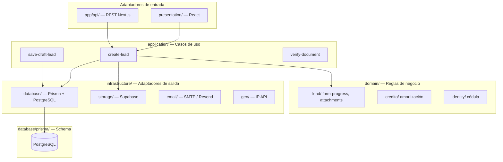

# Arquitectura hexagonal

Coodelsur Landing usa **arquitectura hexagonal** (también llamada *ports & adapters*): el negocio está en el centro y las tecnologías (Next.js, PostgreSQL, Supabase) son adaptadores intercambiables.

## Vista general



## Estructura del repositorio

```
coodelsur-landing/
├── database/                 # Persistencia (schema Prisma)
│   └── prisma/
│       └── schema.prisma
├── docs/                     # Documentación
├── public/                   # Assets estáticos
├── scripts/                  # Utilidades CLI
└── src/
    ├── app/                  # ★ Adaptador HTTP (Next.js — no mover)
    │   ├── api/              # Endpoints REST (delgados)
    │   ├── admin/            # Páginas admin
    │   └── ...               # Páginas públicas
    ├── domain/               # ★ Núcleo — reglas puras, sin I/O
    │   ├── credito/
    │   ├── identity/
    │   └── lead/
    ├── application/          # ★ Casos de uso — orquestación
    │   ├── credito/
    │   ├── identity/
    │   └── lead/
    ├── infrastructure/       # ★ Adaptadores técnicos
    │   ├── auth/             # Sesión admin
    │   ├── database/         # Prisma client, parametros-store
    │   ├── email/
    │   ├── geo/
    │   ├── media/
    │   ├── persistence/      # Fallback JSON (dev)
    │   └── storage/          # Supabase Storage
    ├── presentation/         # ★ UI React
    │   ├── components/
    │   ├── contexts/
    │   ├── forms/
    │   ├── hooks/
    │   └── tracking/
    └── shared/               # ★ Transversal
        ├── config/           # Productos, montos, site
        ├── content/          # Textos legales
        ├── data/             # Bancos, departamentos
        ├── types/
        ├── utils.ts
        └── validation/       # Schemas Zod
```

## Responsabilidad por capa

| Capa | Qué va aquí | Ejemplo |
|------|-------------|---------|
| **domain/** | Entidades, reglas de negocio puras | Validar formato cédula, calcular progreso formulario |
| **application/** | Casos de uso que coordinan dominio + infra | `create-lead`, `save-draft-lead` |
| **infrastructure/** | Detalles técnicos (DB, APIs externas) | Prisma, Supabase upload, SMTP |
| **presentation/** | Interfaz de usuario | Formularios, hooks, componentes |
| **app/** | Rutas Next.js (adaptador HTTP) | `route.ts` llama a `application/` |
| **shared/** | Config y utilidades sin lógica de negocio | Montos, tipos TS, Zod schemas |
| **database/** | Schema y migraciones | `schema.prisma` |

## Flujo de una solicitud

1. Usuario envía formulario → `presentation/components/forms/FormularioCredito.tsx`
2. `POST /api/leads` → `app/api/leads/route.ts` (adaptador delgado)
3. Valida con `shared/validation/nanocredito.ts`
4. Ejecuta `application/lead/create-lead.ts`
5. Sube adjuntos vía `infrastructure/storage/upload.ts`
6. Persiste con `infrastructure/database/prisma.ts`
7. Schema definido en `database/prisma/schema.prisma`

## Alias de importación (TypeScript)

```typescript
import { createLead } from "@/application/lead/create-lead";
import { calcularDesgloseCuota } from "@/domain/credito/amortizacion";
import { prisma } from "@/infrastructure/database/prisma";
import { FormularioCredito } from "@/presentation/components/forms/FormularioCredito";
import { nanocreditoSchema } from "@/shared/validation/nanocredito";
```

## Reglas para el equipo

1. **Nuevo caso de uso** → `application/<contexto>/`
2. **Regla de negocio pura** → `domain/<contexto>/`
3. **Nuevo adaptador técnico** → `infrastructure/<tipo>/`
4. **Componente UI** → `presentation/components/`
5. **Nueva ruta API** → `app/api/` (solo parseo HTTP + llamada a application)
6. **Cambio de schema DB** → `database/prisma/schema.prisma` + `npm run db:push`

## Documentos relacionados

- [ARCHITECTURE.md](./ARCHITECTURE.md) — flujos y decisiones técnicas
- [CODEBASE.md](./CODEBASE.md) — mapa de archivos (actualizar tras migración)
- [BACKEND_SETUP.md](./BACKEND_SETUP.md) — PostgreSQL / Supabase
- [src/README.md](../src/README.md) — resumen rápido en el código
